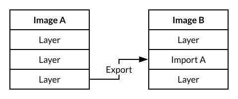

# Layercake

[](https://travis-ci.org/tommy351/layercake) [](https://ci.appveyor.com/project/tommy351/layercake/branch/master

Layercake is a command line tool for building complex Docker images. It can export layers from  images and import them to other images easily. It's useful when you are trying to build some images with many dependencies.



## Installation

You can install Layercake with one of the methods below:

### Install Script

```sh
curl -sL https://github.com/tommy351/layercake/raw/master/install.sh | sh
```

### Docker

<https://hub.docker.com/r/tommy351/layercake/>

```sh
docker run -it --rm \
  -v /var/run/docker.sock:/var/run/docker.sock:ro \
  -v $(pwd):/src \
  -w /src \
  tommy351/layercake
```

### go get

```sh
go get -d github.com/tommy351/layercake
```

## Getting Started

Clone the examples.

```sh
git clone https://github.com/tommy351/layercake
```

Change to the example directory.

```sh
cd examples/hello_world
```

Build images.

```sh
layercake build
```

## Configuration

You can specify the path of config files by adding `--config` option, or it looks for config files in one of the following paths from the current working directory:

- `layercake.yml`
- `layercake.yaml`

The following is an example of a config file.

```yaml
# List all images to be built
# You don't have to sort the builds by their dependencies. Layercake resolves
# dependencies and builds images in order.
build:
  foo:
    # Base image (required)
    from: alpine
    # Image tags (optional)
    tags:
      - fooapp:tag
      - tommy351/fooapp:tag
    # Build arguments (optional)
    args:
      foo: bar
    # A list of images used for cache resolution (optional)
    cache_from:
      - alpine
    # Image labels (optional)
    labels:
      foo: bar
    # Build scripts (required)
    # Just like Dockerfile
    scripts:
      # You can use a string
      - RUN echo hello
      # Or a map
      - run: echo hello
      # The value can be any type
      - env:
          VERSION: 1.2.3
      # Import other layers from other builds
      - import: bar
  bar:
    from: busybox
    scripts:
      - run: echo bar
```

## FAQ

### Why not a plain Dockerfile?

Cache doesn't work when you try to modify one of lines in Dockerfile. You have to sort scripts to make sure the cache can do the best effort.

### How about multi-stage builds?

It can be difficult to read if there are too many stages in Dockerfile. Also, you have to remember paths to copy from other stages.

## License

MIT
